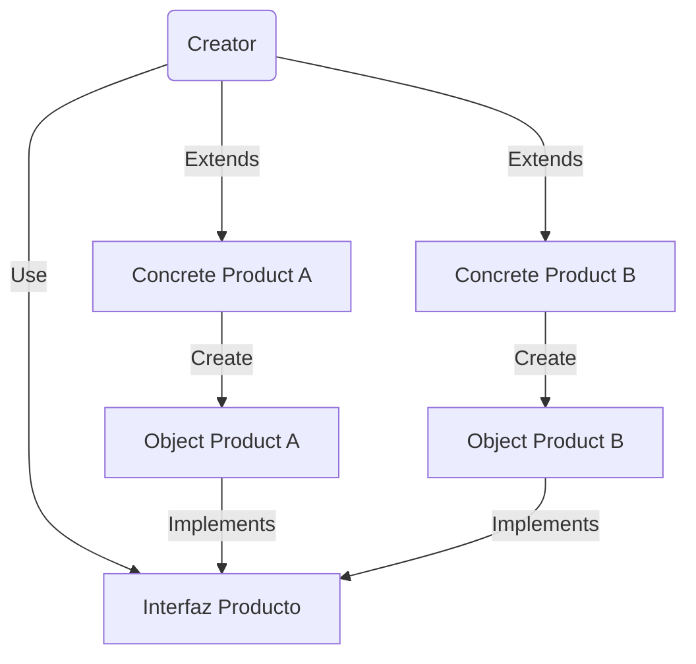
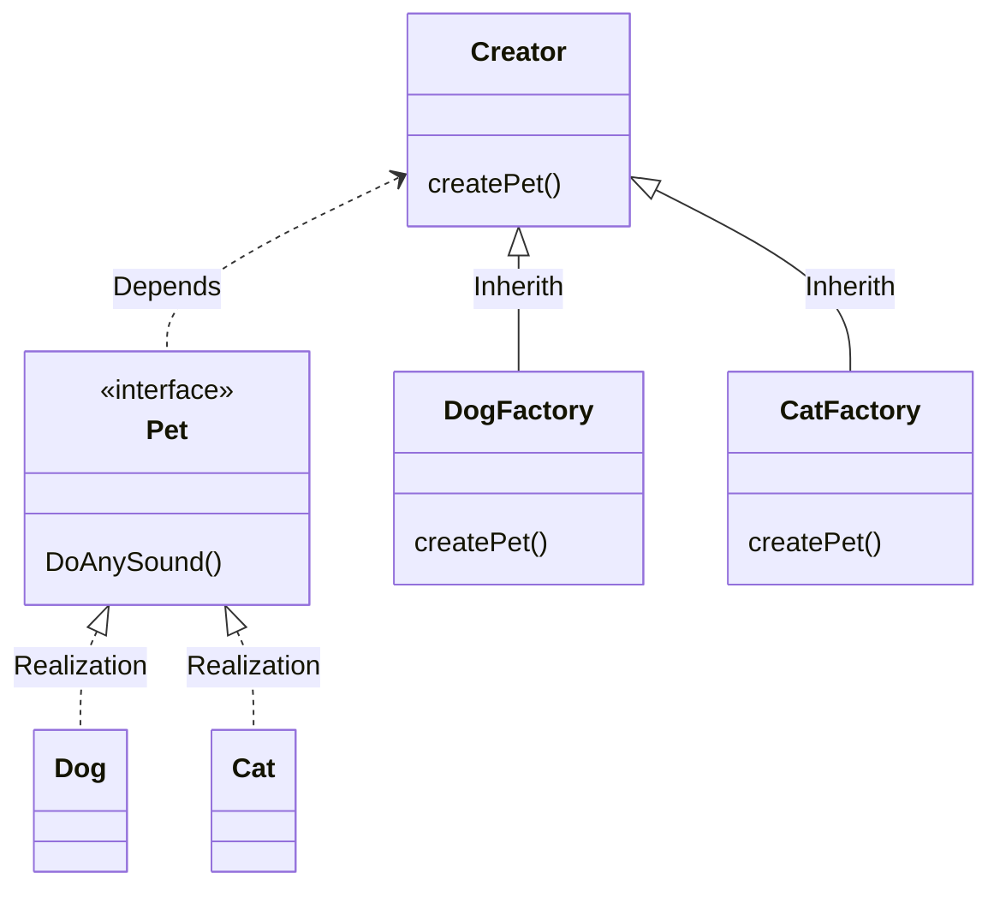

---

**Tags:** #Develop #Develop/Architecture #Develop/Architecture/DesignPattern 
**Links:** 
* https://refactoring.guru/es/design-patterns/factory-method
* 

---
# What is?
- A pattern that give an interface to create objects by a superclase, while the subclases can modify the objects that it's created.

## Overview Flow

---

# About the problem
- When you created an app, it's very common develop only *thinking in the actual feature* but doesn't in the future. That generates *acopled problems*

* Think, you are creating an app to veterinary, and you need to create a system to manage pets, today the requierement it's only to dogs, but in the future you need to implement's the same software to Cat's. *¿What do you going to do?*


---
# How solve the problem
- This pattern allow the possibility to create `Animals Class` by a `Creator Super-Class`, the reason: Have a centralizated creator of elements with the same purpose.

- The `Dog Class` will be saved as an `Pet` in the veterinary, and the `Cat Class` have a similar interaction, those have some differences, the Dog don't purr, so the implementation of the `DoingASound()` **method** will be different for the Cat and the Dog.

- Using this pattern, *all the Pets will have the same interface type* in this case, *all the Animals will be Pets* and each Pet will have an different `Sound` **attribute**, while the `Factories` *extends the Creator Behaviour*.

- The `Creator` *always will be return the same interface type*.

---
# Foundations/Structure

## Class Diagram


## 1. Declares the interface:
This one will be Common to all the **Fabrics** that will be created by the `Creator Class`.

## 2. Concrete Pets:
Are different products that were created by the corresponding `Factory Class`

## 3. Creator Delacration
The `Creator` *always will return the same type* and this one need match with the `Interface Type` of the `Pet Class`.

## 4. Concrete Factories
The Factories *override the base Factory Method to can return a different* `Object Class`

---
# How implement
1. Make *all products follow the same interface*. This interface should declare methods that make sense in every product.
    
2. Add an empty factory method inside the creator class. *The return type of the method should match the common product interface*.
    
3. In the creator’s code find all references to product constructors. One by one, replace them with calls to the factory method, while extracting the product creation code into the factory method.
    
4. Now, create a set of creator subclasses for each type of product listed in the factory method. *Override the factory method* in the subclasses to create the corresponding Class correctly.

---
# Usage Tips
- **Uncertainty and Scalable Software:** Use the Factory Method *when you don’t know beforehand the exact types and dependencies of the objects* your code should work with.

- **Extend a Element:** Use the Factory Method when you want to provide users of your library or framework with a way to *extend its internal components*.

- **Reuse an Element for Memory:** Use the Factory Method when you want to *save system resources by reusing* existing objects instead of rebuilding them each time.

---
# Pros-Contras

## Pros
- **Uncoupling:** You avoid tight coupling between the creator and the concrete products.

* **Single Responsibility Principle**. You can move the product creation code into one place in the program, making the code easier to support.

* **Open/Closed Principle**. You can introduce new types of products into the program without breaking existing client code.

## Cons
* **Code hardy to understand:** The code *may become more complicated* since you need to introduce a lot of new subclasses to implement the pattern. The best case scenario is when you’re introducing the pattern into an existing hierarchy of creator classes.

# Example

*Interface `Pet` to any Animal that will be created in the factories*
```ts
abstract class Pet {
  abstract doAnySound();
}

class Dog extends Pet {
  doAnySound(): void {
    console.log('Guaf Guaf!');
  }
}

class Cat extends Pet {
  doAnySound(): void {
    console.log('Purrrr!');
  }
}
```

*Interface `PetFactory` to all the factories that will be return the same Class*
```ts
abstract class PetFactory {
  abstract addPet();
}

class DogFactory extends PetFactory {
  createPet(): Dog {
    return new Dog();
  }
}

class CatFactory extends PetFactory {
  createPet(): Cat {
    return new Cat();
  }
}
```

*Function will create a factory by a param*
```ts
const appFactory = (factory: PetFactory) => {
  const pet: Pet = factory.createPet();
  pet.doAnySound(); // Any Sound
}
```

*Function that asigns a factory by Type and return the Factory Type*
```ts
const createFactory = (type: FactoryType) => {
  const factories = {
    [FactoryType.CAT]: CatFactory,
    [FactoryType.DOG]: DogFactory,
  }
  const Factory = factories[type];
  return new Factory();
}

appFactory(createFactory(FactoryType.CAT)); // Purrrr!
appFactory(createFactory(FactoryType.DOG)); // Guaf Guaf!
```

 