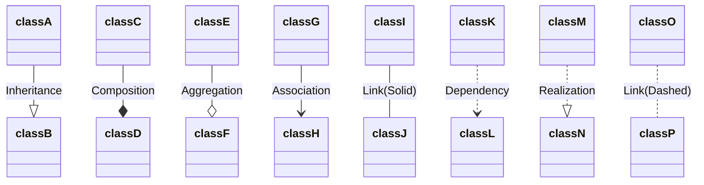

---

**Tags:** #Develop 
**Links:** 
* 

---

# What is?
-

# Basic Usages
-

# Advanced Features
-

# Usage Tips
-

# Best Practices
-

# Bad Practices
-

# Roadmap
-

---

**NOTE:** For a Software pattern

# What is?
-

# About the problem
-

# How solve the problem
-

# Foundations (Structure)
-

# How implement
-

# Usage Tips
-

# Pros-Contras
-

# Code Example
-